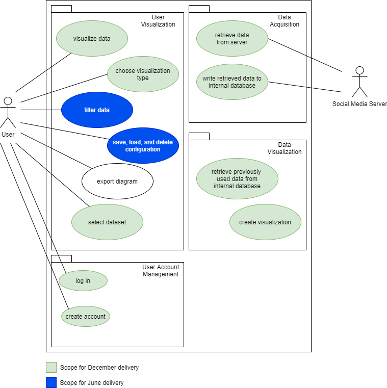
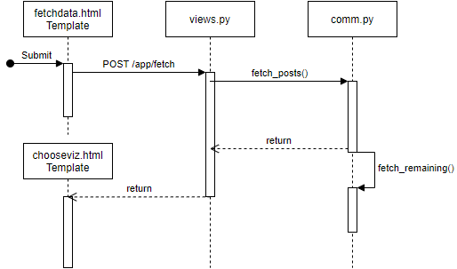

# Software Architecture Document

## 1. Introduction

### 1.1 Purpose

This document provides a comprehensive architectural overview of the system,
using a number of different architectural views to depict different aspects of the system.
It is intended to capture and convey the significant architectural decisions which have been made on the system.

### 1.2 Scope

This software architecture document gives a broad overview of the Socialyze app from a variety of architectural views.
It will *not* cover every detail of the use cases described herein.
For this information, please refer to the individual use case documents linked below.

### 1.3 References

- [GitHub](https://github.com/soshalyze/socialyze)
- [Blog](https://socialyze807275475.wordpress.com/)
- [Use Case Overview](../usecase/use_case_diagram.png)
- [Software Requirements Specification](../usecase/SRS.md)
- [UC Document: Data Retrieval](../usecase/fetchdata/fetchdata.md)
- [UC Document: Choose Visualization](../usecase/choosevisualization/choosevisualization.md)
- [UC Document: Filter Datasets](../usecase/filterdata/filterdata.md)
- [UC Document: Save and Retrieve Visualizations](../usecase/configcrud/configcrud.md)
- [Heroku Production App](https://soshalyze.herokuapp.com)
- [Heroku Staging App](https://socialyze-staging.herokuapp.com)
- [Travis CI](https://travis-ci.com/github/soshalyze/socialyze)
- [Codacy Static Code Analysis](https://app.codacy.com/gh/soshalyze/socialyze/dashboard)
- [Codecov.io Code Coverage Analysis](https://app.codecov.io/gh/soshalyze/socialyze)

## 2. Architectural Representation

As Socialyze is built on the Django web framework, it uses a Model-View-Template (MVT) architecture.
An MVT functions similarly to the widely-used Model-View-Controller architecture.
However, Django itself takes care of much of the controller's functionality,
leaving the developer to focus on the view's functions and the frontend design in the templates.

MVT Diagram:

## 3. Architectural Goals and Constraints

### 3.1 Server-Side

Socialyze is hosted on the Heroku deployment platform.
The production app is located at [the Heroku production app](https://soshalyze.herokuapp.com),
while a developer version for testing and integrating changes is located at [the Heroku staging app](https://socialyze-staging.herokuapp.com/).

The Heroku apps track the `main` and `develop` branches of the [Socialyze GitHub Repository](https://github.com/soshalyze/socialyze), respectively.
The Travis CI build pipeline triggers a deployment to the corresponding pipeline component after a commit and successful subsequent build and test process.

Code quality analysis and code metrics are provided by [Codacy](https://app.codecov.io/gh/soshalyze/socialyze) and test coverage analysis and visualization is provided by [Codecov.io](https://app.codecov.io/gh/soshalyze/socialyze).
Test coverage is and should remain around 90%, meaning the vast majority of workflow code should be covered.
Additionally, code quality should remain at an **A** grade with the current quality control settings.

### 3.2 Client-Side

For access to the Socialyze webapp, clients require a reasonably up-to-date webbrowser.
All other requirements lie on the server side.

### 3.3 CI/CD Pipeline

Continuous integration, testing, and deployment is managed via [Travis CI](https://travis-ci.com/github/soshalyze/socialyze).

### 3.4 Database

The app uses a PostgreSQL database, although potential other RDBMS systems are reasonably easy to migrate to.
For less intensive development purposes, Django in particular supports `sqlite` without further dependencies.
Other alternatives include MariaDB and MySQL.
New database connections are configurable using the `dj_database_url` package, which allows a new DB connection to be substituted into the system by setting a new `DATABASE_URL` environment variable.

### 3.5 Social Media API Communication

Python libraries `praw` and `tweepy` handle the API calls to Reddit and Twitter, respectively.
Modules `reddit_comm` and `twitter_comm` provide the interface to retrieve posts from either network and save them to the application database.

### 3.6 Visualization

The visualization of datasets is handled via individual [Plotly Dash sub-applications](https://dash.plotly.com/).
These are integrated into the frontend templates using the `django-plotly-dash` python package.
Initial parameters are passed to the sub-applications via the template.
User interaction is managed entirely by the Dash applications themselves, saving visualizations is a communication between the app and the app database.

## 4. Use-Case View

The following use cases define the core functionality of the app:

- Retrieve Data from Server
- Choose a Visualization Type and Parameters
- Filter Datasets within the Visualization
- Save and Retrieve Visualizations
- Export Visualizations
  

### 4.1 Retrieve Data From Server

*Brief Description*: Logged-in users are able to trigger the retrieval of content and associated metadata (submission date, karma/like count, etc.) for a given social media user handle. The retrieved data is stored in the app database.

See [UC Document: Data Retrieval](../usecase/fetchdata/fetchdata.md).

### 4.2 Choose Visualization Type and Parameters

*Brief Description*: Logged-in users may select from an assortment of visualization modes and submit their retrieved datasets for visualization.

See [UC Document: Choose Visualization](../usecase/choosevisualization/choosevisualization.md).

### 4.3 Filter Datasets

*Brief Description*: After creating a visualization, a user may filter the data by predefined parameters, interactively changing the visualization.

See [UC Document: Filter Datasets](../usecase/filterdata/filterdata.md).

### 4.4 Save and Retrieve Visualizations

*Brief Description*: Users may save visualizations after creating them. The associated parameters and modalities are saved to the app database, where the user may retrieve them at a later date or subsequent login.

See [UC Document: Save and Retrieve Visualizations](../usecase/configcrud/configcrud.md).

## 5. Logical View

The application as a whole can be split up into three subsystems: user management, data retrieval, and data visualization.

### 5.1 User Management Subsystem

The module `django.users.auth` provides the necessary functionality for user registration and authentication.
The `users` package implements the Registration and Login views by using the functions provided by `django.users.auth`.
The `app` subsystem provides the main functionality of the application.
The database models in `app` are tied to the `User` model of the `auth` package as foreign keys.

Generally, in order to use the app, a user must be registered and logged in.
If a user is not logged in, he will be asked to do so as soon as he attempts to access the dashboard view.
The Django-internal `django.users.auth` module manages these access restrictions.

### 5.2 Data Retrieval Subsystem

The package `comm` handles communication between Socialyze and the social media networks (currently Reddit and Twitter).
`reddit_comm` and/or `twitter_comm` are triggered when a user submits the corresponding `fetch` form.
The retrieved datasets are then written to the application database.

### 5.3 Data Visualization Subsystem

The package `dash_apps` contains the implementations of the various data visualization modes.
Using parameters passed to it from `app`'s forms/views, it creates and initializes a Dash app by retrieving the relevant datasets from the application database.

## 6. Process View

### 6.1 User Registration and Login

Upon successful login, Socialyze presents the user with his personal dashboard.
The dashboard shows past saved visualizations.
Additionally, the user has the option to fetch new data and create new visualizations.

### 6.2 User Data Fetch Process

Following a successful data fetch, Socialyze presents the user with the visualization screen.
The user may choose to instantly create a visualization with the fetched dataset, or return to the dashboard to fetch another.

### 6.3 User Visualization Creation

The user creates a visualization by selecting a mode, dataset, and the maximum number of data points to use in the visualization.
These parameters are then passed to the Dash app as initial arguments.

## 7. Deployment View

## 8. Implementation View

## 9. Data View

Socialyze uses a PostgreSQL database backend.
The database provides storage for the following information:

- application user data (relations managed by the `django.auth.users` subsystem)
- social media data (social media user handles and dataset content)
- links between fetched datasets and users (i. e. which user fetched which dataset)

The database consists of parts defined within the `app` subsystem and those defined by other subsystems that are not part of the scope of this document (external apps and libraries).

## 10. Size and Performance

Depending on the size of the userbase, the size of the database and the computing power may require upscaling.
The current Heroku specifications are sufficient for a functional demo application.
However, to use the app productively, the database will need an upgrade.
Heroku currently imposes a limitation of 10,000 database rows, which a moderately sized repository of data points pulled from either Reddit or Twitter will exceed very quickly.

## 11. Quality

| Factor          | Architecture Impact |
|---              |---|
| Usability       | Socialyze uses conventional web forms for user input, inputs are filtered to make selection easier. |
| Maintainability | Functionality is split into largely independent modules, allowing for easy customizations and extensions. |
| Portability     | Installation requires a supported database (Django supports many different RDBMS) and a Python installation, which are readily available or configurable on most web servers. |
| Reliability     | n/a |
| Efficiency      | n/a |
