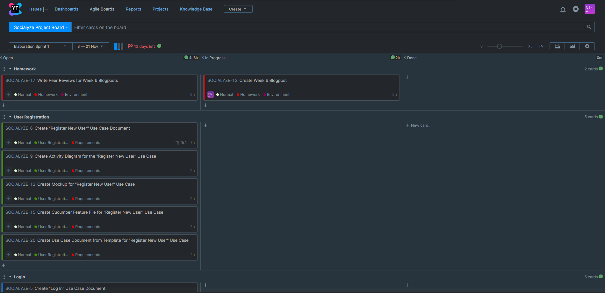
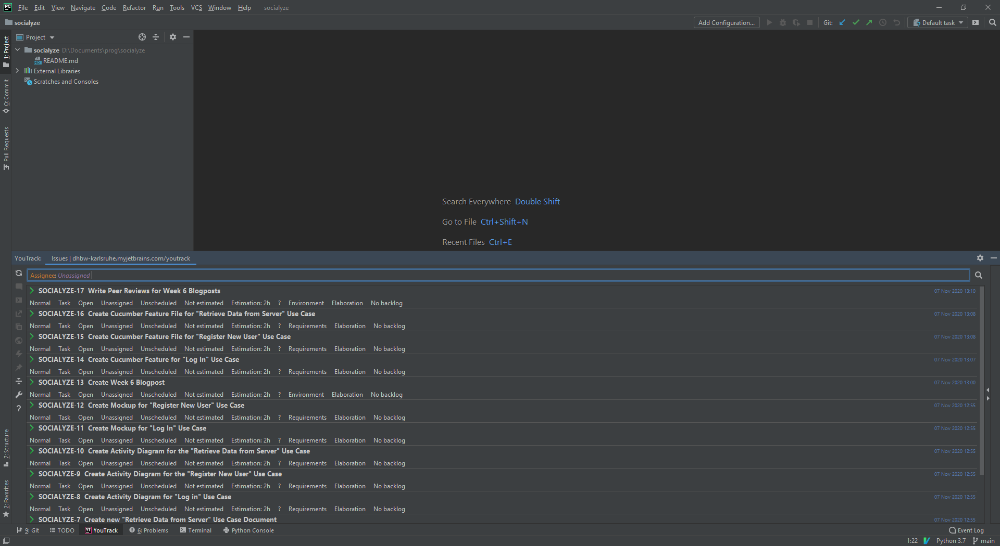
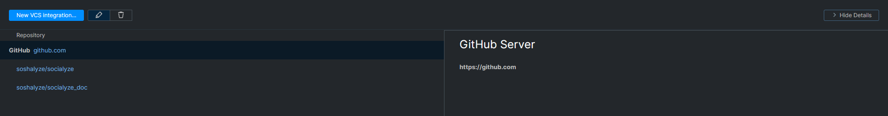
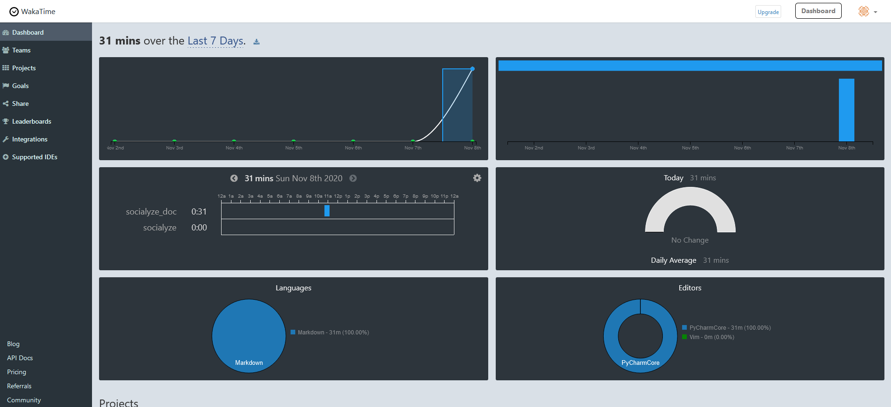

# Week 6 - Connecting the ~~Dots~~ Tools

Hello everyone,

we started our [first real sprint](https://dhbw-karlsruhe.myjetbrains.com/youtrack/agiles/108-84/109-423) this week!

It's currently set to last for two weeks, and we seem to have a lot of work ahead of us right now.
Still, we're confident that the goals we've set are realistic and we can finish it all over the next 14 days.

We also did some work integrating our IDEs, VCS, and project management tools.
Basically, we've connected everything to everything now. Our dev environment is a triangle.

On YouTrack, the agile board for our first sprint has gotten pretty full, right now it looks like this:

You can see that I opened the first task a short while ago.
It's actually the issue for writing this first blog post.
About an hour from now, which is when I hope to be done, I'll move it into the "done" column.

The tasks are organized by type, which we decided to group into the different use cases for now.
They're even color-coded for convenience.
There's a separate type for homework issues,
since we don't expect to be fully done with those until the end of next semester.

---

As you can see in the screenshot below, we can now access our YouTrack backlog and current sprint issues via PyCharm.
The integration is seamless, as is to be expected from two JetBrains tools:

Each issue has a time estimation associated with it.
We opted to go for actual time units instead of story points for now (and probably for the rest of the project),
since putting our estimations in actual hours seemed the most sensible and immediately useful to us.

---

The next connection we established was between our YouTrack PM tool and our GitHub repository (*pictured above*).
This way, we can associate commits with ongoing or finished tasks on our scrum boards.
The YouTrack-GitHub connection was by far the easiest to set up (aside from perhaps the GitHub-PyCharm integration).
YouTrack has fantastic documentation on how to set up the connection correctly.

---

The third and final component is a time-tracking plugin.
JetBrains offer a variety of those, so we opted for a very careful and scientific way of choosing:
We picked the one that had the most downloads, which was **WakaTime**. Funky name. Funky graphics, too!

WakaTime is a project time-tracking service that you can use with a GitHub account.
All you need to do is register and log in, follow the plugin installation instructions for your IDE(s) of choice,
and start editing your project files.

Since I work with both PyCharm and Vim for editing text documents, I tried out both plugins writing this blog post.
I ended up writing the blog post in PyCharm, but the plugin works really well with Vim, and it's easy to install
using your friendly neighborhood Vim plugin manager.

WakaTime also tracks your activity by Git commits or GitHub project pull requests.
We haven't tested those yet, but we're excited to see those stats pop up here as well.

Overall this assignment was actually kind of fun.
It's nice to see how well our chosen tools for this assignment integrate with each other.
And the time visualization is a nice cherry on top, since we expect to be doing some visualizing ourselves
once we get into the meat of this project.

That's about all for this week, we hope to see you again soon!

The Socialyze Team