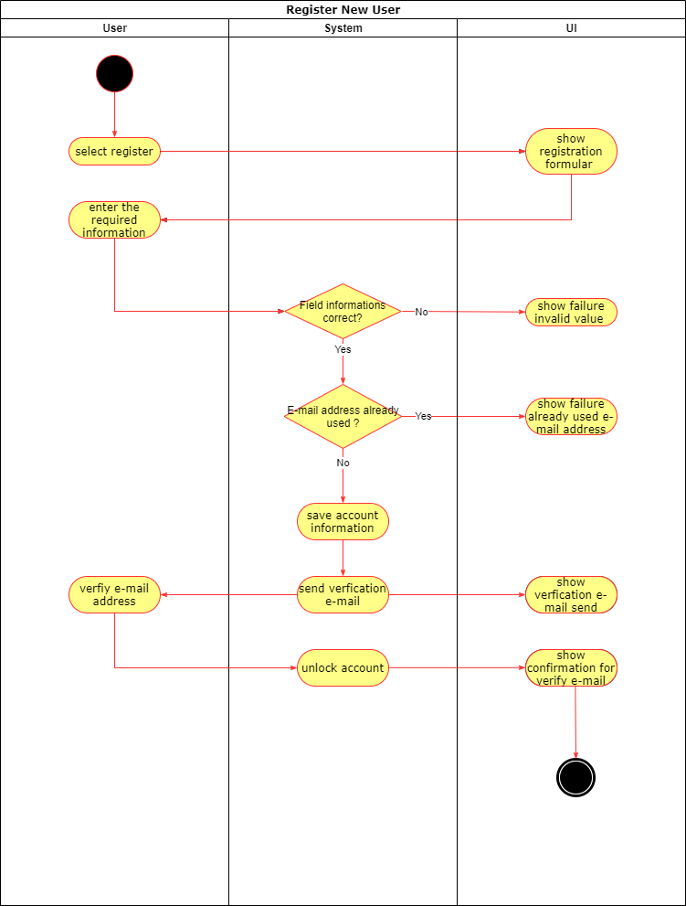
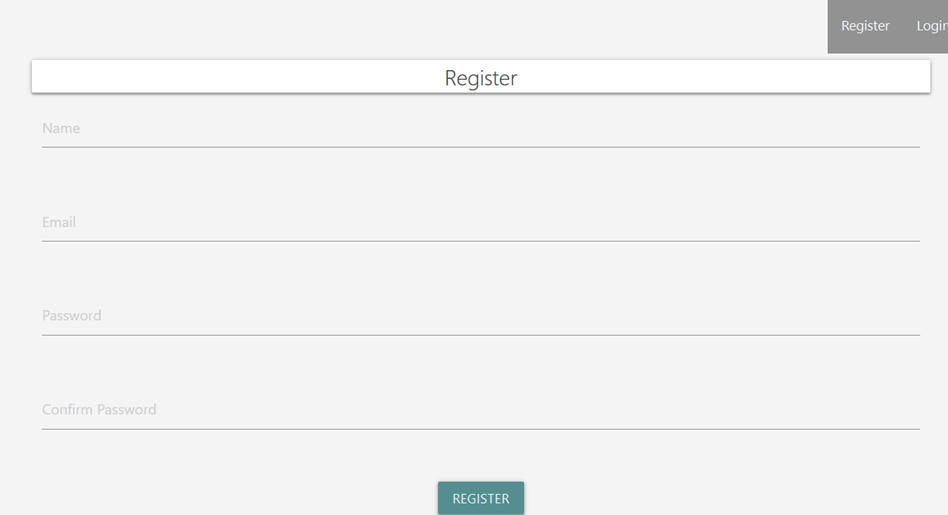

# 1 Use-Case: Register New User

## 1.1 Brief Description

A user wants to create a new account on Sozialyze.
For this he has to register.
The User must provide following information.
- Username
- E-Mail address
- First name
- Last name
- Password

# 2 Flow of Events

## 2.1 Basic Flow

- The user choose on the login site the option register.
- He type in his information and get a mail to verify his account.
- After the successful confirmation of the mail his account will be unlocked.

### 2.1.1 Activity Diagram

### 2.1.2 Mock-Up

### 2.1.3 Narrative

## 2.2 Alternative Flows

(n/a)

# 3 Special Requirements

(n/a)

# 4 Preconditions

## 4.1 E-Mail Address

The user needs a valid mail address.

# 5 Postconditions

(n/a)
 
# 6 Extension Points

(n/a)
