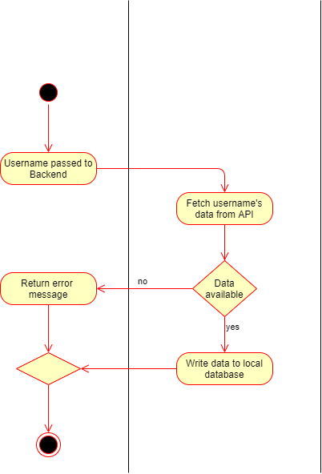
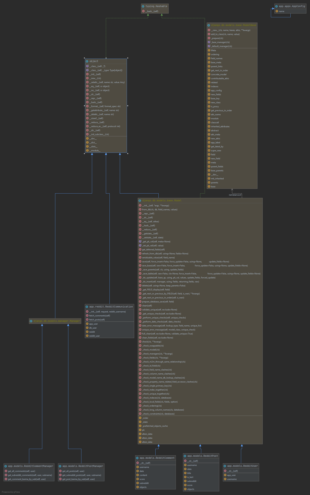

# 1 Use-Case: Retrieve Data from Social Media Site

## 1.1 Brief Description

This use case describes the retrieval of user data (e.g. posts and comments) from a social media site.
For the prototype, we will be using Reddit profiles as input.

# 2 Flow of Events

## 2.1 Basic Flow

- A user triggers a request to the backend with a username.
- The social media connector fetches (part of) available data from the social media site's API.
- Fetched data is stored in the local database.

### 2.1.1 Activity Diagram

### 2.1.2 Class Diagram

## 2.2 Alternative Flows

(n/a)

# 3 Special Requirements

(n/a)

# 4 Preconditions

## 4.1 Registered

The user placing the request must have a registered account.

## 4.2 Logged In

The user placing the request must be logged in.

# 5 Postconditions

(n/a)
 
# 6 Extension Points

(n/a)
