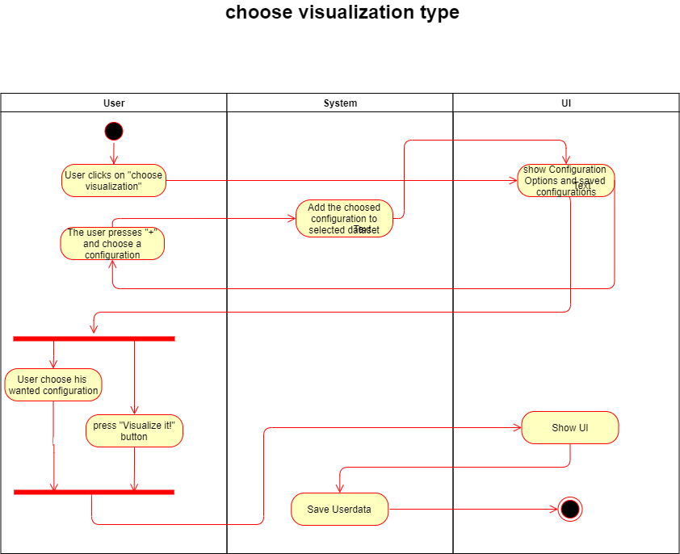
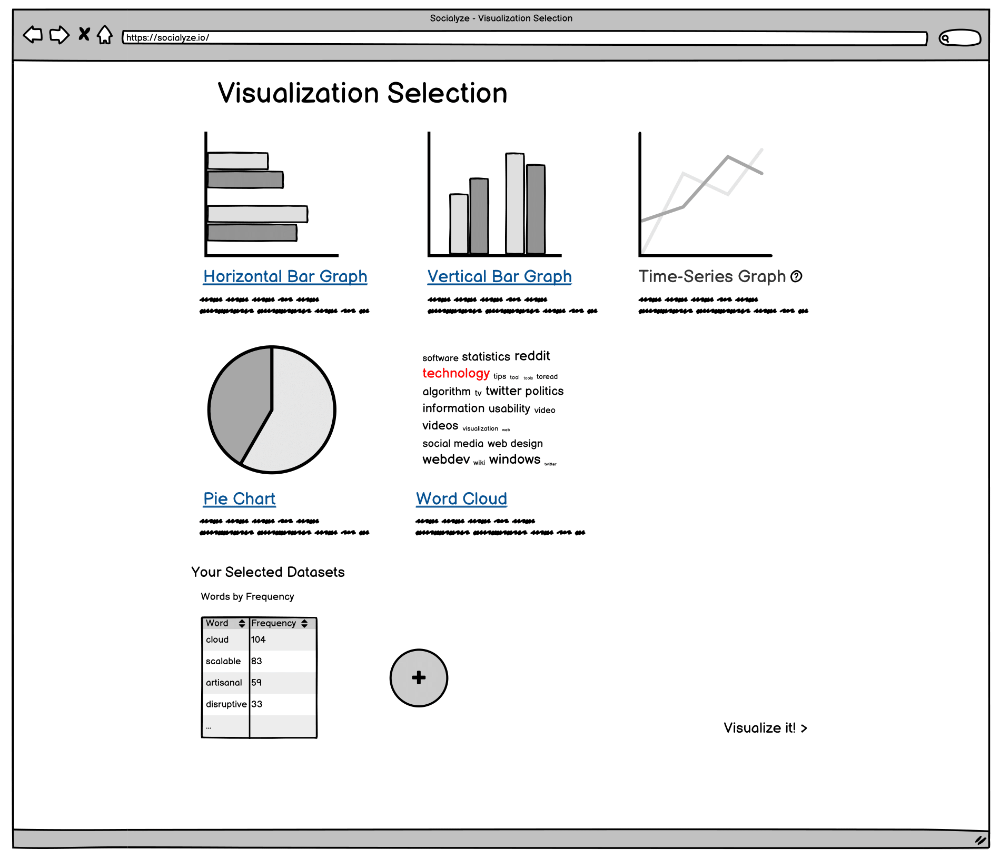

# 1 Use-Case: Select Visualization Type

## 1.1 Brief Description

After selecting a dataset, a user can choose compatible visualization types to visualize it.

# 2 Flow of Events

## 2.1 Basic Flow

- User selects a visualization type from those available.
- User may click the "add more datasets" button to add further datasets to his visualization.
- If a new visualization becomes available through the addition of the new dataset, the user may select it.

### 2.1.1 Activity Diagram

### 2.1.2 Mock-up

### 2.1.3 Narrative

(n/a)

## 2.2 Alternative Flows

(n/a)

# 3 Special Requirements

(n/a)

# 4 Preconditions

## 4.1 Login

The user has to be logged in to the system.

## 4.2 Dataset(s)

The user must have selected at least one dataset to visualize.

# 5 Postconditions

(n/a)
 
# 6 Extension Points

(n/a)
