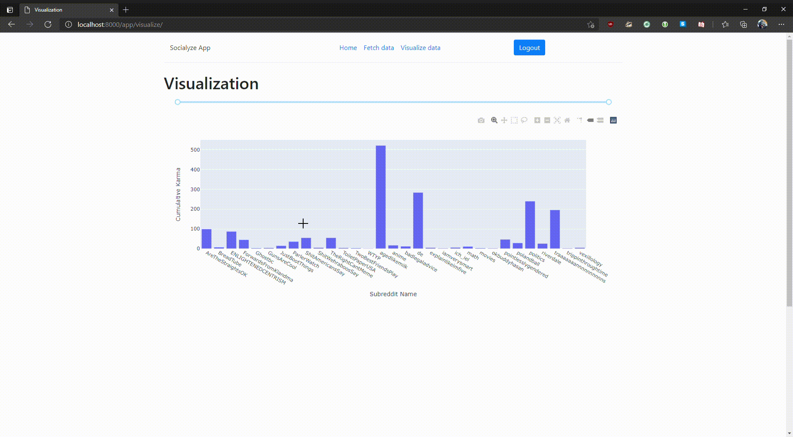

# Creating Visualizations with Plotly Dash

Socialyze uses the `django-plotly-dash` library to integrate Dash apps as interactive visualizations.

## Dash App Components

A Dash app consists of an HTML-based layout description and a series of callback functions.
The callback functions take inputs from the interactive control elements (if present) in the layout and return the corresponding outputs to other elements in the app.

For concrete information on UI elements and callback construction see the [Dash documentation](https://dash.plotly.com/).

## Example: The Subreddit Karma Visualization



The following section describes the implementation of a sample Dash app for use within Socialyze.
The app visualizes a Reddit user's cumulative Karma (post or comment) over all subreddits they've commented in.
Additionally, the Socialyze user may filter the data points by a minimum or maximum point threshold for the individual comments.
This is realized by adding a `RangeSlider` at the top of the graph where a user can set the upper and lower bound for the scores to include.
The callback on this slider filters the original dataset by the new bounds, creates a new figure, and returns it to the `Graph` component of the app.

### The Layout

```python
app = DjangoDash(name='KarmaBySub')

app.layout = html.Div([
    dcc.Input(id='post_type', type='hidden', value='filler'),
    dcc.Input(id='user', type='hidden', value='filler'),
    dcc.Input(id='limit', type='hidden', value='filler'),
    dcc.RangeSlider(id='karma', min=0, max=100, step=1.0, value=[0, 500]),
    dcc.Graph(id='graph'),
    dcc.Store(id='graphparams')
])
```

The three hidden `Input` fields at the beginning allow us to pass initial parameters to the app at startup.
The `RangeSlider` object allows us to set the karma thresholds to filter once our initial graph is set up.
`Graph` is the container object for our Plotly visualization figure.
`Store` represents a browser cache instance that we can use to store the initial parameters of the graph for use in later callbacks.

### The Callbacks

The first callback is used to initialize our app using the data passed by the user in the "Create Visualization" form.

```python
@app.callback(
    Output('karma', 'min'),
    Output('karma', 'max'),
    Output('karma', 'value'),
    Output('graphparams', 'data'),
    Input('post_type', 'value'),
    Input('user', 'value'),
    Input('limit', 'value')
)
def gen_graph(post_type_val, user_val, limit_val):
    posts = get_posts(post_type_val, user_val, limit_val)
    params = dict(
        post_type=post_type_val,
        user=user_val,
        limit=limit_val
    )
    min_score, max_score = get_min_max_score(posts)
    return min_score, max_score, [min_score, max_score], json.dumps(params)
```

A Dash callback takes a series of `Input` and `Output` objects with a given `id` (matching the `id` field in the app layout) and a `value` (the object's field name).
Here, for example, we've set an output to the `value` field of our `karma`-RangeSlider by adding `Output('karma', 'value')` to the callback declaration.

Callback inputs provide the arguments to the callback function.
In this case, our three inputs are `post_type`, `user`, and `limit`.
Consequently, our function takes three arguments in the order they're listed in the callback declaration.
Similarly, our callback has four outputs, which are returned as a tuple in `gen_graph`'s return statement.

The second callback reacts to an input to either the Karma bound slider or the parameter storage.
It creates a figure from the provided posts and displays it in the `Graph` container.
This means that it is always called directly after `gen_graph`.
Dash callbacks are usually called once on app startup.
This is preempted here by adding `prevent_initial_call=True` to the callback declaration.

```python
@app.callback(
    Output('graph', 'figure'),
    Input('karma', 'value'),
    Input('graphparams', 'data'),
    prevent_initial_call=True
)
def filter_posts(karma_limit, params):
    params = json.loads(params)
    post_type_val, user_val, limit_val = params['post_type'], params['user'], params['limit']
    posts = [post for post in get_posts(post_type_val, user_val, limit_val) if karma_limit[0] <= post.score <= karma_limit[1]]
    return create_figure(posts)
```

After the first call, the slider is set to the minimum and maximum scores in the original dataset.
Once the user begins manipulating the slider, the callback `filter_posts` is called again and a new figure based on the filtered dataset is generated and shown.
Since the `Input` fields in the layout are hidden, the original dataset is always present in the visualization as long as the user stays on the page, so every view is recoverable.
