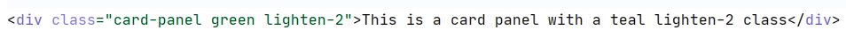

# Materialize css - die Basics

## Intro
Materialize css ist ein Front-End-Framework basierend auf Material Design

Materialize.css wurde von Google mit dem Ziel leicht ein einheitliches design in jeder (Web-)Anwendung zu implementieren entwickelt. Im folgenden gibt's einen kurzen Überblick über die wichtigsten Funktionen vom Materialize css.

Materialize.css besteht dabei aus einer einzigen .css datei, in welcher sehr klug sehr viele Designmöglichkeiten verpackt wurden. (diese ist bei uns durch das django-standard html automatisch eingebunden worden)

## Wie wende ich das an?
 
Bei jedem html-tag gibt es die Eigenschaft class, über diese kann das komplette tag designt werden.

### Coloring
wenn ich einem div-tag eine hintergrundfarbe geben will schreibe ich also

  
Man schreibt also: class="div-art | Farbe | Helligkeit"

alle Farben mit allen Helligkeiten sind hier aufgelistet: https://materializecss.com/color.html

Das beispiel-div würde dann so aussehen:
  

Wenn man einen Text einfärben möchte nimmt man die eigenschaft color-text und text-darken/lighten-helligkeitsstufe
  

Das sieht dann so aus:

  

Wenn man keine Helligkeitsstufe angibt wird einfach nur die Farbe angezeigt (ohne veränderte Helligkeit).

### Grid

Eine Website besteht normalerweise immer aus einer Gitterstruktur (früher hat man Tabellen verwendet, heute nimmt man div-tags, da diese unabhängig voneinander sind)

Diese Gitterstruktur wird bei Materialize in ein Container-div gepackt, dadurch wird automatisch die gitterstruktur an verschiedene gerätegrößen angepasst (bspw. Handy vs Laptop) 

  

Mit Materialize lässt sich diese Gitterstruktur einfach generieren.
Dazu nennt man einfach die class eines div tags row oder col, für Reihe oder Spalte.
  

Insgesamt gibt es dabei bei Materialize 12 spalten, die auf jede art und weise verwendet werden können.

  

Man kann bspw. relativ einfach eine Dreiteilung der Oberfläche mit folgendem Code erreichen: (3 mal s4 -> insgesamt 12 spalten)

  

Außerdem kann man z.B. mit der offset-Eigenschaft eine Spalte verschieben. offset-s6 bedeutet bspw. eine verschiebung um 6 Spalten.

  

  

Weitere coole features zum grid unter: https://materializecss.com/grid.html

### Material-icons

In Materialize ist ein großer pool an verschiedenen icons integriert. Um diese einzufügen verwendet man den html-i-tag:
  

Man kann die Icons in folgenden verschiedenen Größen anzeigen lassen, dazu einfach die class umbenennen

  

unter folgendem Link findet sich eine Liste aller Icons: https://materializecss.com/icons.html

### Weiteres

Da jede Klassenart für jeden html-tag zu erklären für diesen Zweck den Rahmen sprengen würde, war das hier des nur ein überblick über die allerwichtigsten funktionen von Materialize, um ein halbwegs vernünftiges Design zu erstellen.

Hier zum selber nachlesen, falls ihr krasse buttons, floating action buttons, navigationsleisten, preloader, cards, checkboxen, collections, hebel, knöpfe, etc. erstellen wollt, und diese direkt mit einem schönen Design verseht: https://materializecss.com/ 
Dazu einfach auf der linken Seite im Suchfeld nach dem entsprechenden Tag suchen.

