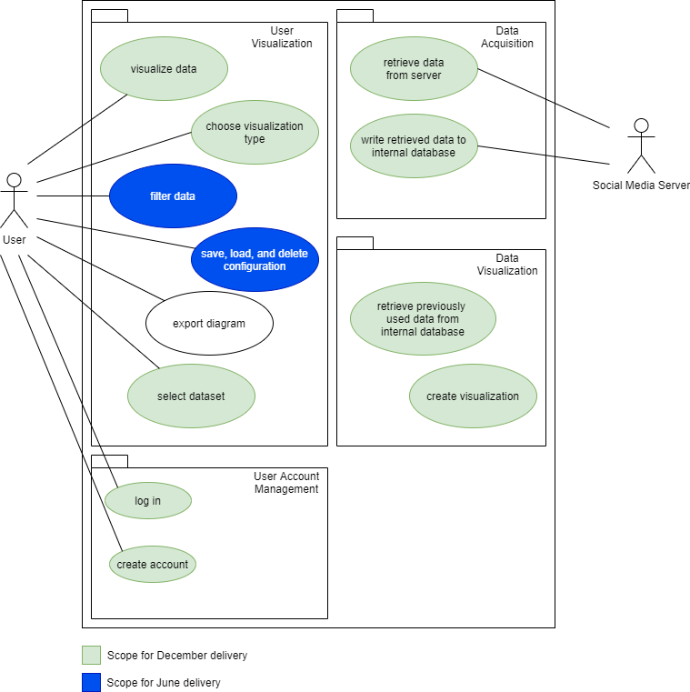

# Socialyze - Software Requirements Specification

## Table of Contents

- [Socialyze - Software Requirements Specification](#socialyze---software-requirements-specification)

  - [Table of Contents](#table-of-contents)

  - [1. Introduction](#1-introduction)

    - [1.1 Purpose](#11-purpose)
      - [1.2 Scope](#12-scope)
      - [1.3 Definitions, Acronyms and Abbreviations](#13-definitions-acronyms-and-abbreviations)
      - [1.4 References](#14-references)
      - [1.5 Overview](#15-overview)

    - [2. Overall Description](#2-overall-description)
      - [2.1 Vision](#21-vision)
      - [2.2 Product perspective](#22-product-perspective)
      - [2.3 User characteristics](#23-user-characteristics)
      - [2.4 Dependencies](#24-dependencies)

    - [3. Specific Requirements](#3-specific-requirements)
      - [3.1 Functionality - Backend](#31-functionality---backend)
        - [3.1.1 Data Acquisition Module](#311-data-acquisition-modul)  
        - [3.1.2 Data Visualization Module](#312-data-visualization-module)

      - [3.2 Functionality - User Interface](#32-functionality---user-interface)
        - [3.2.1 Account Management](#321-account-management)
        - [3.2.2 Fetching Interface](#322-fetching-interface)
        - [3.2.3 Visualization Interface](#323-visualization-interface)

      - [3.3 Usability](#33-usability)

      - [3.4 Reliability](#34-reliability)
        - [3.4.1 Availability](#341-availability)
        - [3.4.2 MTBF, MTTR](#342-mtbf-mttr)
        - [3.4.3 Accuracy](#343-accuracy)
        - [3.4.4 Bug classes](#344-bug-classes)

      - [3.5 Performance](#35-performance)
        - [3.5.1 Response time](#351-response-time)
        - [3.5.2 Throughput](#352-throughput)
        - [3.5.3 Capacity](#353-capacity)
        - [3.5.4 Resource utilization](#354-resource-utilization)

      - [3.6 Supportability](#36-supportability)

      - [3.7 Design Constraints](#37-design-constraints)
        - [3.7.1 Development tools](#371-development-tools)
        - [3.7.2 Supported Platforms](#372-supported-platforms)

      - [3.8 Online User Documentation and Help System Requirements](#38-online-user-documentation-and-help-system-requirements)

      - [3.9 Purchased Components](#39-purchased-components)

      - [3.10 Interfaces](#310-interfaces)
        - [3.10.1 User Interfaces](#3101-user-interfaces)
        - [3.10.2 Hardware Interfaces](#3102-hardware-interfaces)
        - [3.10.3 Software Interfaces](#3103-software-interfaces)
        - [3.10.4 Communications Interfaces](#3104-communications-interfaces)

      - [3.11 Licensing Requirements](#311-licensing-requirements)

      - [3.12 Legal, Copyright and other Notices](#312-legal-copyright-and-other-notices)

      - [3.13 Applicable Standards](#313-applicable-standards)

    - [4. Supporting Information](#4-supporting-information)

## 1. Introduction

### 1.1 Purpose

This Software Requirements Specification (SRS) was created to collect and organize the requirements for the Socialyze application.
The SRS describes requirements, both functional and non-functional, for the application.
It includes an overview about this project and its vision, detailed information about the planned features and boundary conditions of the development process.

### 1.2 Scope

This application will be an information visualization web application where users can create custom visualizations of their own or other public social network posts.
Users will be able to choose from a selection of websites and datasets to create visualizations in order to better study or portray social media trends and topics.
The site will offer an interactive graphical interface over which the users can select datasets and types of visualizations (bar graphs, diagrams, word clouds).
Users will be able to filter data by certain aspects, such as score ("likes") or the timeframe in which the posts were made.

### 1.3 Definitions, Acronyms and Abbreviations

| Term     |                                     |
| -------- | ----------------------------------- |
| **SRS**  | Software Requirements Specification |
| **API**  | Application Programming Interface   |
| **MTBF** | Mean Time Between Failures          |
| **MTTR** | Mean Time To Repair                 |
| **REST** | Representational State Transfer     |
| **n/a**  | not applicable                      |
| **tbd**  | to be determined                    |

### 1.4 References

**tbd**

### 1.5 Overview

The following chapter provides an overview of this project with vision, the functionality of the result and an Overall Use Case Diagram.
The third chapter (Requirements Specification) delivers more details about the specific requirements in terms of functionality, usability and design parameters.
In order to achieve a high level of specification in defining the requirements, all functions presented in the diagram are separated into subsections of section "3.1 Functionality".
And last there is chapter four with supporting information.

## 2. Overall Description

### 2.1 Vision

Socialyze will offer its users an online interface that allows them to extract data from their social media profiles by entering their user data.
Users can then create visualizations from these datasets that allow them to gain insights into their social media activities.
For example, a Reddit user will be able to create a ranking of their most posted to or commented on subreddits, or a word cloud of their comments.
A Twitter user will be able to view a time-series of the number of tweets made per day.

The app will consist of a web presence created in Python's *Django* framework.
The site will allow users to save their social media datasets to a server-side database.
From there, the data can be reused on subsequent visits.
Users will be able to choose one or more datasets and a compatible visualization, which the app will then create and display.
From there, a user will have the option to export the visualization and save a local copy.

## 2.2 Product Perspective

Socialyze is a webapp, i.e. an online presence accessed by users via a web browser.
It will include the following features:

- **User accounts** - Users will be able to create an account on the site.
  Users may then add various social media identities (providers tbd) to their account.
  Depending on the accounts added, users will then have access to various datasets mined from their social media presence.
- **Visualization toolbox** - A user will be able to select datasets from his social media presence and visualization types
  (e.g. bar graphs, time-series graphs, word clouds).
  The app will then create a visualization conforming to the user's specifications.
- **Database** - User datasets scraped or collected from the social network API will be stored in the app's database,
  where users will be able to access them on subsequent logins.
- **Export** - Users will be able to export and save the visualizations they create.
- **Data filtering** - Users will be able to filter datasets by certain criteria, such as their age or content.

### 2.3 User Characteristics

The user needs a modern graphical web browser and access to the internet in order to use Socialyze.
While a fundamental understanding of information visualization is certainly useful,
the goal of the app is to provide an interface that enables lay users to create interesting visualizations.
Additionally, the user will need to supply one or more social media identities.
Therefore, in order to meaningfully use the application, a user must have at least one account on a social media site supported by Socialyze.

### 2.4 Dependencies

Socialyze is heavily dependent on the social media sites it draws its datasets from.
In particular, this means that the app is very dependent on the APIs it uses to query data from social media sites.
If a site does not supply a certain data point (e.g. a channel's exact subscriber count on YouTube, as of September 2019),
then the data point cannot be made available to users.
The app's functionality may also be impacted by possible overhauls or redesign efforts on part of its data source pages, should webscraping be used as a means of obtaining user information.

On the user side, the app is dependent on the type of web browser used.
A browser that does not support HTML5 will struggle to correctly display the content of Socialyze.
Socialyze is, for obvious reasons, incompatible with a text-based webbrowser.
For development purposes, the team will limit itself to developing the app for use with the current versions of three widely used webbrowsers:
Mozilla Firefox, Google Chrome, and Microsoft Edge (as of 18/10/2020).

## 3. Specific Requirements

### Use Case Diagram

### 3.1 Functionality - Backend

#### 3.1.1 Data Acquisition Module

In order to create data visualizations, Socialyze must obtain datasets from social media sites.

- **Data Retrieval via API** - Most social media sites offer REST APIs for both automated content query and creation.
  Socialyze will make extensive use of these APIs to fetch its datasets.
- **Write to DB** - Fetched social media data will be written to the application's database for future (re)use.
- **Dataset Association to Application Users** - Datasets in the local database will be associated to registered application users.
  This will allow users to select from among their "owned" datasets for visualization creation.
  If a user queries a dataset that is already in the database, that user will simply be associated to the dataset without fetching it again.

#### 3.1.2 Data Visualization Module

A user will be able to create an interactive visualization from a dataset.
The visualization will include predefined filters for the user to filter the dataset by given attributes (post score, post date, etc.).

- **Fetch Data from Database** - To create a visualization, the module must retrieve the corresponding dataset from the application database.
- **Filter Data in Visualization** - The visualization will include a filtering functionality that allows the user to reduce the number of elements in the dataset
  according to predefined attributes using one or more UI elements (sliders, checkboxes).
  This data must be passed into the backend to filter the dataset accordingly.
- **Save and Delete Visualizations** - Users will be able to save their current visualization configurations and load them from their dashboard on subsequent logins.
  Additionally, users will be able to delete any visualizations they have previously saved.
  The database must accurately reflect these interactions.

### 3.2 Functionality - User Interface

#### 3.2.1 Account Management

- **User Creation** - Before using the main functionality of the site, a user will need to register an account.
  The user's information will include their full name and a valid e-mail address.
- **User Login** - Upon entering their correct login information (username and password), the user will be logged in and allowed access to the site's functions.
  Should a site visitor attempt to access site functionality without authentication, they will be redirected to the login screen.
- **Password Reset** - Users will be able to reset their password by requesting a reset link sent to their e-mail address.

#### 3.2.2 Fetching Interface

- **Source Selection** - Users will be able to choose a social media site and a type of post (e.g. Reddit post vs. Reddit comment) to fetch as their dataset.
- **Instance Limit Restriction** - Users will be able to choose an upper bound on the number of post instances to fetch.
  Socialyze will fetch posts up to this limit synchronously (so the user may immediately proceed with creating a visualization), the rest will be fetched in the background.

#### 3.2.3 Visualization Interface

- **Select Visualization Type** - Users will be able to select a number of visualization types.
  Depending on the type of visualization selected, users will see their datasets that are compatible with the chosen visualization type.
- **Select Associated Datasets** - Users may select only datasets that are associated with their account, i. e. datasets they have requested for fetching.
- **Instance Limit Restriction** - Users may restrict the size of their dataset with an upper limit on instances a priori.
  Users may interactively filter the posts in this dataset later on, in the visualization screen.
- **Displaying Visualization** - Upon requesting the visualization, the user will be redirected to the visualization screen.
- **Filter and Update** - On the visualization screen, the user may interact with UI elements (sliders) to filter posts by certain attributes like dates or scores.

### 3.3 Usability

- **Responsiveness** - Users should receive feedback quickly on their entries.
- **Intuitiveness** - Forms for fetching and visualizing should be easily usable without much additional documentation.
- **Failure Handling** - Users should receive feedback on failures in the fetching or visualization process.

### 3.4 Reliability

- **Failure Detection** - Errors in user input (e. g. nonexistent social media user handles) should be either prevented or caught as early as possible.

#### 3.4.1 Availability

Socialyze should be highly available once running in production, with an availability of >95% uptime.

#### 3.4.2 MTBF, MTTR

Automated recovery is not a part of the requirement scope, so MTTR is not definable.
Failures should be rare, however, given the relatively high determinism of the system.

#### 3.4.3 Accuracy

n/a

#### 3.4.4 Bug Classes

- **Security Defects** - This is more related to development issues.
  Leaks of API keys used in the backend is a concern.

### 3.5 Performance

#### 3.5.1 Response time

n/a

#### 3.5.2 Throughput

n/a

#### 3.5.3 Capacity

Within the boundaries of this project, Socialyze will be required to support up to 5 users with two or three datasets each.

#### 3.5.4 Resource utilization

Socialyze will be relatively lightweight, requiring a few hundred MB of space for installation of its dependencies.
Database size depends largely on frequency of use and number of users, which is difficult to predict.
However, measures have been taken to keep databases as space-efficient as possible.

### 3.6 Supportability

Socialyze will be maintained by the Socialyze Team.

### 3.7 Design Constraints

As Socialyze is a student project, its operating environment will not be equal to that of professional web applications.
This implies significant limitations on database size and speed of operation.

#### 3.7.1 Development tools

Socialyze will be developed using the following tools and suites:

- JetBrains PyCharm Professional
- Visual Studio Code
- JetBrains YouTrack

#### 3.7.2 Supported Platforms

Socialyze will support modern graphical web browsers compliant with W3C and HTML5 specifications.
Socialyze will be tested with Microsoft Edge, Google Chrome, and Mozilla Firefox.

### 3.8 Online User Documentation and Help System Requirements

Documentation will be provided in the [Socialyze Documentation GitHub Repository](https://github.com/soshalyze/socialyze_doc).

### 3.9 Purchased Components

n/a

### 3.10 Interfaces

#### 3.10.1 User Interfaces

Socialyze's UI will be built in Django's template system with the Bootstrap CSS framework used for visual design.

#### 3.10.2 Hardware Interfaces

n/a

#### 3.10.3 Software Interfaces

The Socialyze backend will be addressed via a REST API.
This API should not be accessible via CLI or programmatically, however, and must be addressed over a web browser by a user (person).

#### 3.10.4 Communications Interfaces

(see above)

### 3.11 Licensing Requirements

Socialyze will be licensed under the MIT license.
Major components Socialyze depends on exist under the same license.

### 3.12 Legal, Copyright and other Notices

Socialyze is licensed under the [MIT License](https://mit-license.org/).

### 3.13 Applicable Standards

n/a

## 4. Supporting Information

- [Django](https://djangoproject.com/)
- [Socialyze GitHub Repository](https://github.com/soshalyze/socialyze)
