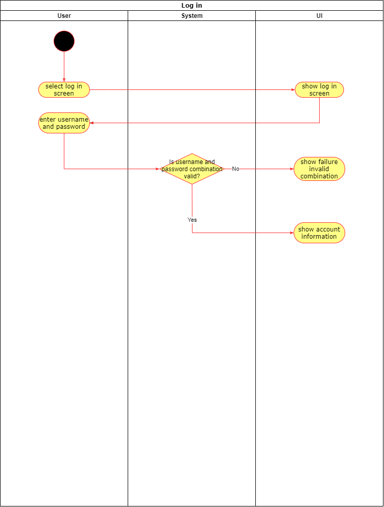
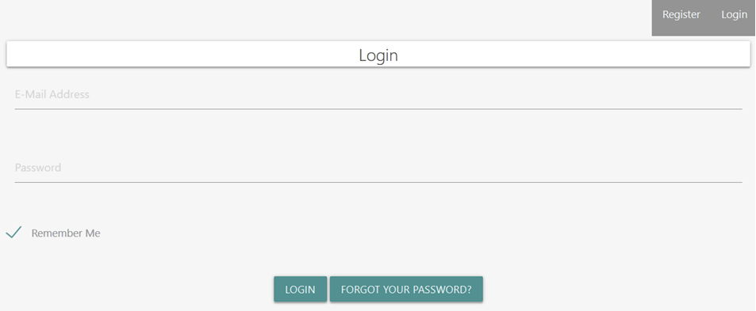

# 1 Use-Case: Log in

## 1.1 Brief Description

A user wants to sign in with his account on Sozialyze.
For this he has to enter the correct password and username.

# 2 Flow of Events

## 2.1 Basic Flow

- The user enter a correct user password combination.
- The user get access to the account.

### 2.1.1 Activity Diagram

### 2.1.2 Mock-Up

### 2.1.3 Narrative

## 2.2 Alternative Flows

(n/a)

# 3 Special Requirements

(n/a)

# 4 Preconditions

## 4.1 E-Mail Address

The user needs a valid mail address.

# 5 Postconditions

(n/a)
 
# 6 Extension Points

(n/a)
