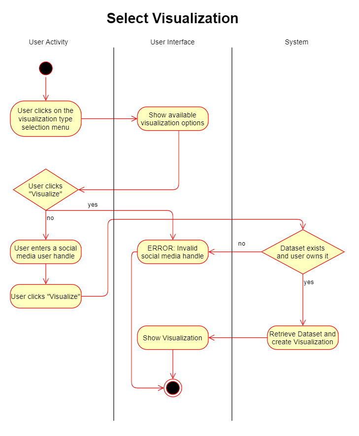
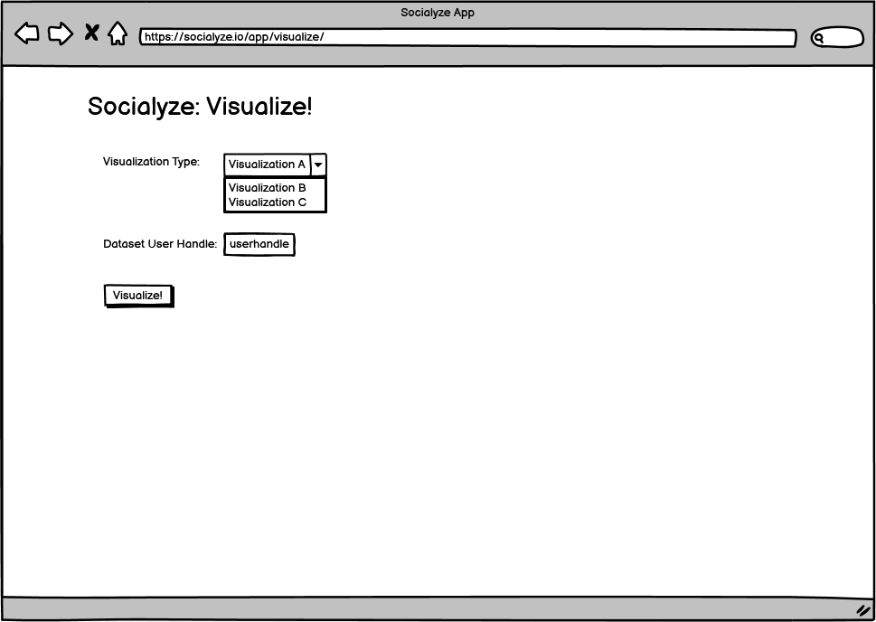

# Use Case: Select Visualization

## 1 Brief Description

After associating one or more datasets with his account, a user can choose compatible visualization types to visualize it.

## 2 Flow of Events

### 2.1 Basic Flow

1. User selects a visualization type from those available.
2. User selects a social media handle of a dataset associated with his account.
3. User clicks the "Visualize" Button.
4. A subsequent page is displayed containing the selected visualization.

#### 2.1.1 Activity Diagram



#### 2.1.2 Mock-up



#### 2.1.3 Narrative

```gherkin
Feature: Select Visualization

As a user, select a visualization type and a dataset associated to user account
and display a visualization

Scenario: User successfully creates a visualization
  Given user is logged in with username testuser and password testpass
  When user accesses /app/visualize/
  When user selects visualization type karma_by_sub
  And user selects dataset thisisbillgates
  And user clicks visualize
  Then display visualization

Scenario: User selects an invalid dataset handle
  Given user is logged in with username testuser and password testpass
  When user accesses /app/visualize/
  And user selects visualization type karma_by_sub
  And user selects dataset invalid_dataset
  And user clicks visualize
  Then display error
```

### 2.2 Alternative Flows

1. The user clicks "Visualize" without entering a dataset handle.
2. A page with an error message is displayed, telling the user that his dataset handle was invalid.

## 3 Special Requirements

(n/a)

## 4 Preconditions

### 4.1 Login

The user has to be logged in to the system.

## 5 Postconditions

(n/a)

## 6 Extension Points

(n/a)
