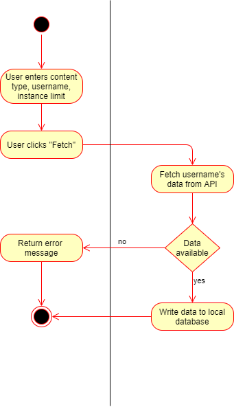

# Use Case: Retrieve Data from Social Media Site

## 1 Brief Description

This use case describes the retrieval of user data (e.g. posts and comments) from a social media site.

## 2 Flow of Events

### 2.1 Basic Flow

1. A user triggers a request to the backend with a username.
2. The social media connector fetches (part of) available data from the social media site's API.
3. Fetched data is stored in the local database and associated with the querying app user.

#### 2.1.1 Activity Diagram

#### 2.1.2 Mockup

#### 2.1.3 Database Model

Data structure for social media data is represented in the `app` section of the below DB model diagram.

### 2.2 Alternative Flows

If the user profile of the targeted social media site does not exist,
the API is currently inaccessible, or other errors occur, an error message is returned
and must be handled by the app internals.

## 3 Special Requirements

The API of the targeted social media site must match either the library or own code used to fetch the data.

## 4 Preconditions

### 4.1 Registered

The user placing the request must have a registered account.

### 4.2 Logged In

The user placing the request must be logged in.

## 5 Postconditions

The fetched data is saved to the local database according to the outlined entity-relationship model (see 2.1.3).

## 6 Extension Points

(n/a)
