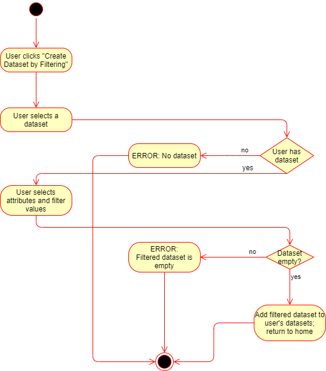

# Use-Case: Create Filtered Datasets

## 1 Brief Description

User will be able to filter data according to a set of predefined options.

## 2 Flow of Events

### 2.1 Basic Flow

1. User creates a visualization using the "Create Visualization" workflow.
2. Visualization shows options to filter according to the dataset used.
3. User may interactively filter the posts by certain aspects (e.g. score, date).
4. Visualizations will respond to inputs by the user according to the filter settings.

#### 2.1.1 Activity Diagram

#### 2.1.2 Mock-up

![Filter Data Mockup]

#### 2.1.3 Narrative

(n/a)

## 2.2 Alternative Flows

(n/a)

## 3 Special Requirements

(n/a)

## 4 Preconditions

### 4.1 Login

The user has to be logged in to the system.

### 4.2 Existing Dataset

The user must have at least one social media dataset associated with his account.

### 4.3 Existing Visualization

The user must have created a visualization from one of his datasets.

## 5 Postconditions

(n/a)

## 6 Extension Points

(n/a)
