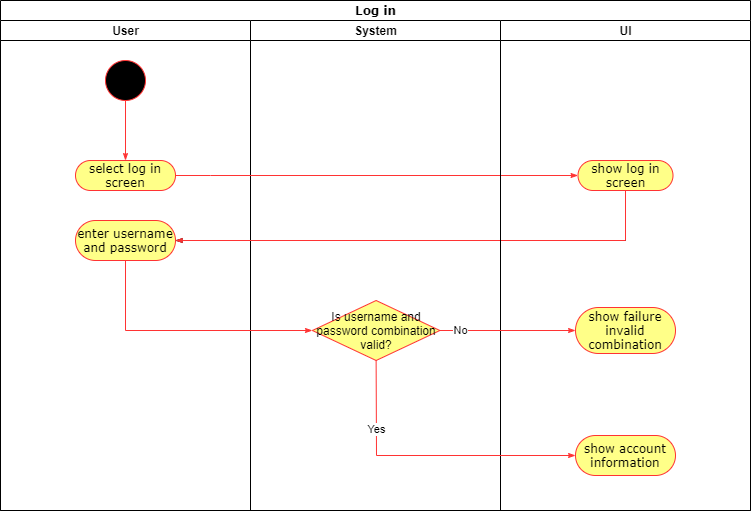
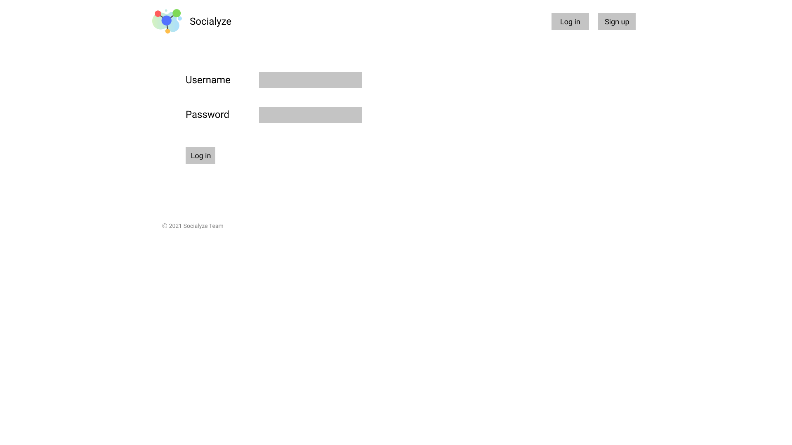

# Use-Case: Log in

## 1 Brief Description

A user wants to sign in with his account on Sozialyze.
For this he has to enter the correct password and username.

## 2 Flow of Events

### 2.1 Basic Flow

1. User enter a correct user password combination.
2. User get access to the account.

#### 2.1.1 Activity Diagram

#### 2.1.2 Mock-Up

#### 2.1.3 Narrative

[Login Feature File](login.feature)

### 2.2 Alternative Flows

1. User enters a wrong or nonexistent username-password combination.
2. User is redirected back to the login form with a notification to enter a correct username-password combination.

## 3 Special Requirements

(n/a)

## 4 Preconditions

### 4.1 Registration

The user must be registered with a valid e-mail address.

## 5 Postconditions

The user is logged in with access to the main application functionality.

## 6 Extension Points

(n/a)
