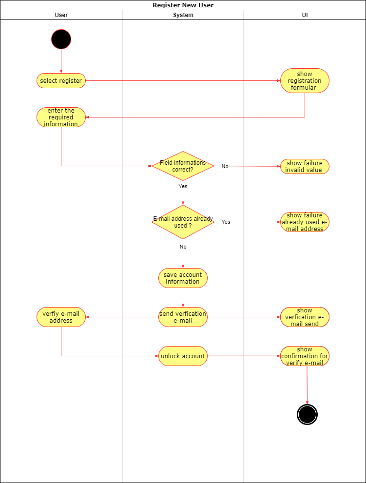

# Use Case: Register New User

## 1 Brief Description

A user wants to create a new account on Sozialyze.
The user must provide following information.

- Username
- E-Mail address
- First name
- Last name
- Password

## 2 Flow of Events

### 2.1 Basic Flow

1. User clicks on "Sign up".
2. User enters his information.
3. User is logged in with his new account.

#### 2.1.1 Activity Diagram

#### 2.1.2 Mock-Up

#### 2.1.3 Narrative

### 2.2 Alternative Flows

1. User enters an existing username or e-mail address.
2. User is redirected to the registration page with a notice that this account already exists.

## 3 Special Requirements

(n/a)

## 4 Preconditions

## 4.1 E-Mail Address

The user needs a valid mail address.

## 5 Postconditions

(n/a)

## 6 Extension Points

(n/a)
