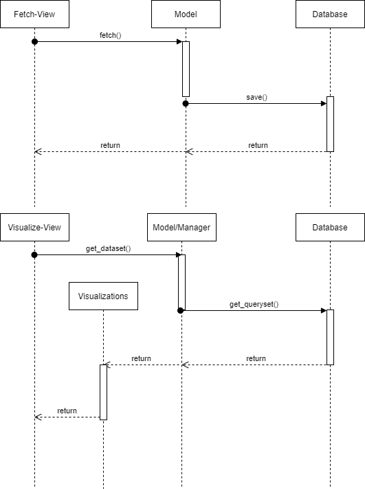

# 1 Use-Case: Save / Retrieve Social Media Data from DB

## 1.1 Brief Description

Social media data fetched from an API or by web scraping should be saved in a local database and retrieved when reused.

# 2 Flow of Events

## 2.1 Basic Flow

- After a fetch, write data to local DB.
- Assign the written data to an app user.
- When a user wants to create a visualization involving the dataset, retrieve the data from local DB.

### 2.1.1 Sequence Diagram

# 3 Special Requirements

(n/a)

# 4 Preconditions

(n/a)

# 5 Postconditions

(n/a)
 
# 6 Extension Points

(n/a)
