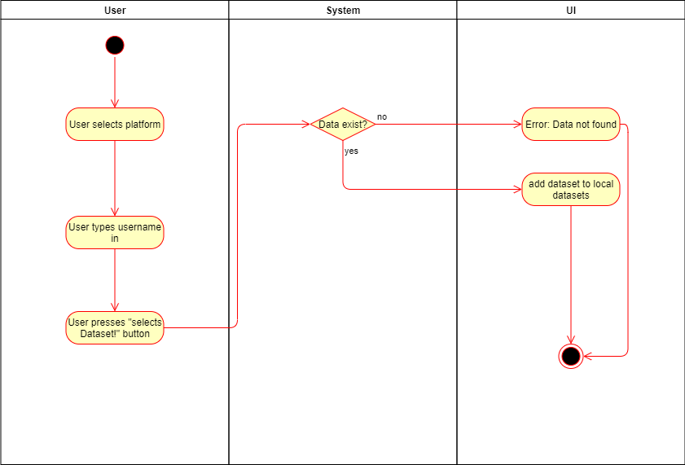
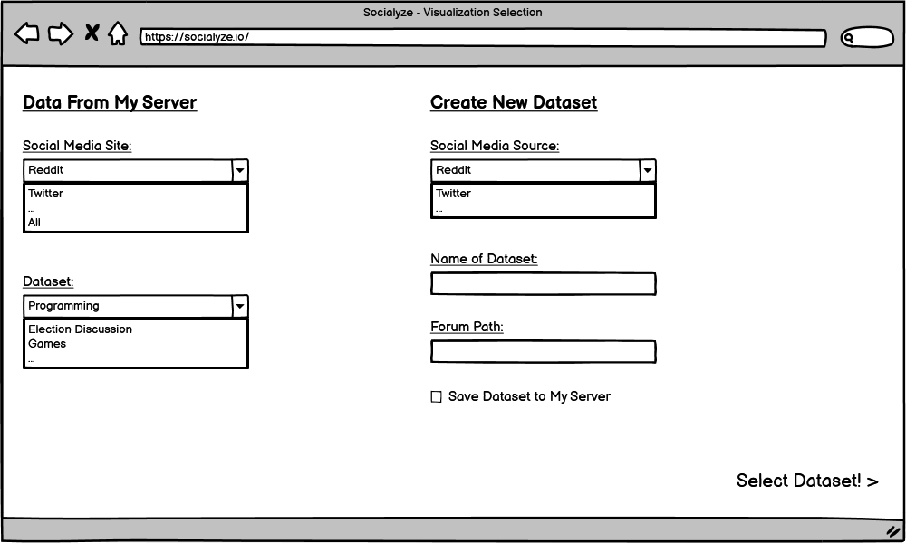

# 1 Use-Case: Select Dataset

## 1.1 Brief Description

A logged-in user may select a specific dataset, dependent on the social media sites he has permitted the app to access.
If the dataset is already available in the app's database, it is retrieved from there.
Otherwise, it is retrieved from the social media site's API or via web scraping.

# 2 Flow of Events

## 2.1 Basic Flow

- User chooses column "Data from my Server" or "Create New Dataset", depending on query from local DB or social media site.
- From local DB, user may select a named dataset.
- From social media, user may enter a path to query from and name the dataset.

### 2.1.1 Activity Diagram

### 2.1.2 Mock-up

### 2.1.3 Narrative

## 2.2 Alternative Flows

(n/a)

# 3 Special Requirements

(n/a)

# 4 Preconditions

## 4.1 Login

The user has to be logged in to the system.

# 5 Postconditions

(n/a)
 
# 6 Extension Points

(n/a)
