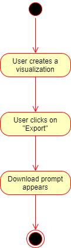

# 1 Use-Case: Exporting Graph and Datasets

## 1.1 Brief Description

After creating a visualization, users will be able to download a visualization and its associated datasets as CSV.

# 2 Flow of Events

## 2.1 Basic Flow

1. User creates a visualization (see "Create Visualization" use case).
2. User clicks the "Export" Option.
3. User is prompted to download a zip file containing the visualization and a CSV of the dataset.

### 2.1.1 Activity Diagram

### 2.1.2 Mock-up

n/a

### 2.1.3 Narrative

n/a

## 2.2 Alternative Flows

n/a

# 3 Special Requirements

(n/a)

# 4 Preconditions

## 4.1 Login

The user has to be logged in to the system.

## 4.2 Existing Dataset

The user must have at least one social media dataset associated with his account.

## 4.3 Existing Visualization

The user must have created a visualization to export.

# 5 Postconditions

(n/a)
 
# 6 Extension Points

(n/a)
