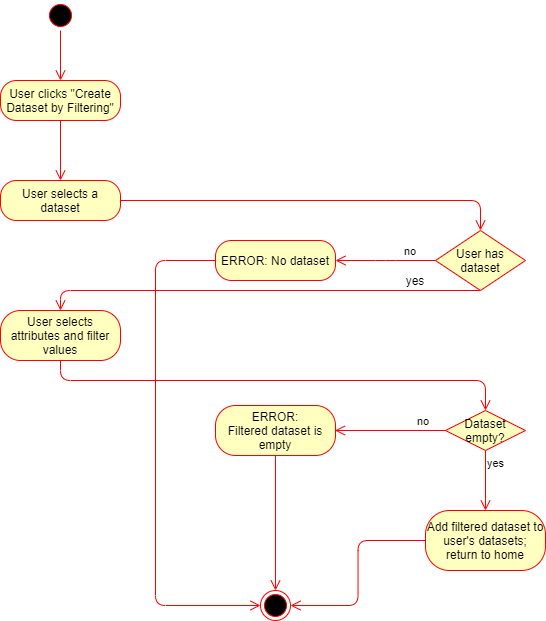

# 1 Use-Case: Create Filtered Datasets

## 1.1 Brief Description

User will be able to filter data according to a set of predefined options.

# 2 Flow of Events

## 2.1 Basic Flow

1. User selects "Create Dataset by Filtering".
2. User selects dataset from the datasets associated to his account.
3. User specifies filter options for the dataset.
4. User clicks the "Create filtered dataset" button.

### 2.1.1 Activity Diagram

### 2.1.2 Mock-up

n/a

### 2.1.3 Narrative

n/a

## 2.2 Alternative Flows

1. The user does not have a dataset associated with his account, or selects an invalid dataset.
2. A page with an error message is displayed, telling the user that his dataset handle was invalid.

1. The user selects filter criteria such that his dataset is empty.
2. No new dataset is created and a page is displayed, telling the user that his selected criteria did not match any data points from his selected set.

# 3 Special Requirements

(n/a)

# 4 Preconditions

## 4.1 Login

The user has to be logged in to the system.

## 4.2 Existing Dataset

The user must have at least one social media dataset associated with his account.

# 5 Postconditions

There must be a reference to the new filtered dataset in the database.
 
# 6 Extension Points

(n/a)
