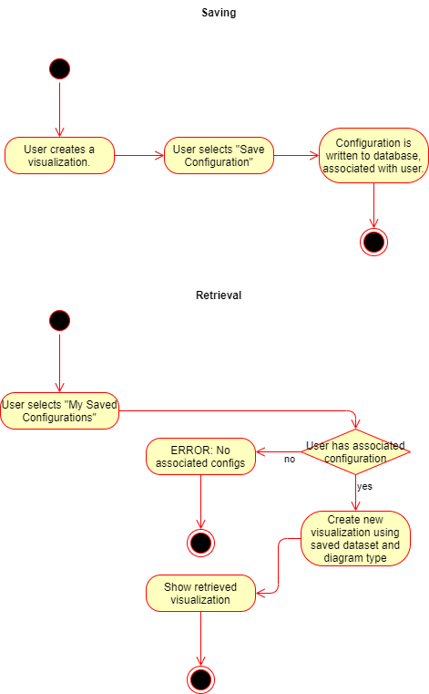

# 1 Use-Case: Save and Retrieve Visualization Configuration

## 1.1 Brief Description

Users will be able to save their visualization options and datasets and retrieve them on subsequent logins.

# 2 Flow of Events

## 2.1 Basic Flow

### 2.1.1 Save

1. User creates a visualization (see "Create Visualization" UC document).
2. User selects "Save Configuration" on the displayed visualization.
3. Dataset and mode of visualization are associated to user in the database.

### 2.1.2 Retrieval

1. User selects "My Saved Configurations" on his dashboard screen.
2. Visualization is generated again and shown to the user.

### 2.1.1 Activity Diagram

### 2.1.2 Mock-up

n/a

### 2.1.3 Narrative

n/a

## 2.2 Alternative Flows

1. The user does not have a previously saved visualization associated with his account.
2. A page is displayed informing the user that he has no saved configurations.

# 3 Special Requirements

(n/a)

# 4 Preconditions

## 4.1 Login

The user has to be logged in to the system.

## 4.2 Existing Visualization

For saving, the user must have created a visualization from an existing dataset.

For retrieval, the user must have saved an existing visualization to his account.

# 5 Postconditions

After saving, there must be a reference to the dataset and mode of visualization associated to the user in the database.
 
# 6 Extension Points

(n/a)
